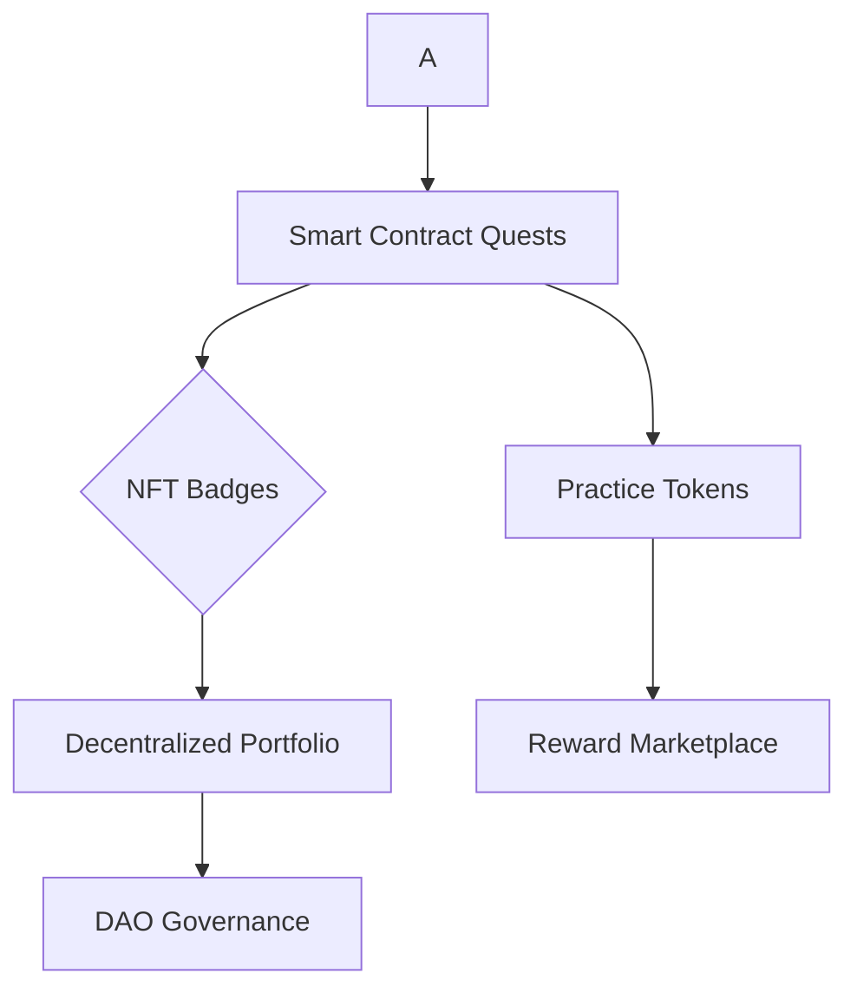
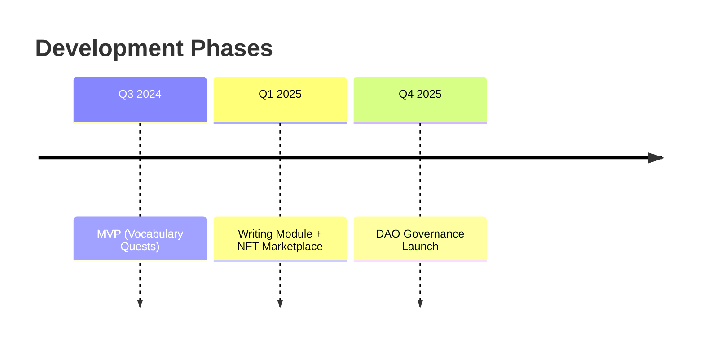

````markdown
# MasteryMaker: Web3-Powered Learning Platform

 <!-- Replace with actual logo -->

**Bridging Digital Engagement with Foundational Learning**

## 🌟 Vision

To merge engaging digital entertainment with deliberate learning practice, fostering robust understanding and confident communication in an evolving world through Web3 technologies.

## 🚀 Problem Addressed

> "Children spend less time on sustained 'work practice' essential for deep learning due to technological distractions."

Traditional systems fail to incentivize the deliberate practice needed for mastery of foundational skills like vocabulary and structured writing.

## 💡 Web3-Powered Solution

### Core Features:

| Feature                          | Description                              | Benefit                                   |
| -------------------------------- | ---------------------------------------- | ----------------------------------------- |
| **Personalized Learning Quests** | Smart contract-defined learning journeys | Tailored content + transparent objectives |
| **Skill NFTs**                   | Verifiable digital badges for mastery    | Tangible achievements + motivation        |
| **Practice Tokens**              | Fungible tokens for daily effort         | Instant rewards for micro-tasks           |
| **Decentralized Portfolio**      | Blockchain-recorded learning history     | Tamper-proof lifelong credentials         |
| **Community DAO**                | Peer feedback & governance               | Collaborative improvement                 |
| **Earn-to-Learn**                | Tokens unlock real-world opportunities   | Sustainable engagement                    |

## 🛠 Technical Architecture


````

## 🎯 Target Users

- **Ages 6-18** with age-appropriate modules:
  - **Elementary**: Gamified vocabulary building
  - **Middle School**: Structured writing frameworks
  - **High School**: Argumentation & debate skills

## 📈 Value Proposition

✅ Turns practice into engaging quests  
✅ Provides verifiable skill credentials  
✅ Creates student-owned learning identity  
✅ Aligns with dopamine-driven engagement patterns  
✅ Scalable through decentralized infrastructure

## 🏆 Unique Differentiators

- **Dual-Token Economy**: NFTs (mastery) + Tokens (effort)
- **Progressive Web3 Onboarding**: From simple badges to DAO participation
- **Real-World Utility**: Tokens redeemable for educational opportunities

## 🚧 Roadmap



## 💻 Getting Started

```bash
git clone https://github.com/Warmarth/MasteryMakers.git
cd MasteryMaker
npm install
npm run dev
```

## 🤝 Contribute

We welcome educators and developers! Join our:

- [Discord Community](https://discord.gg/cobbyfranky)
- GitHub Issues for feature requests

## 📜 License

MIT © 2024 MasteryMaker Team

```

```